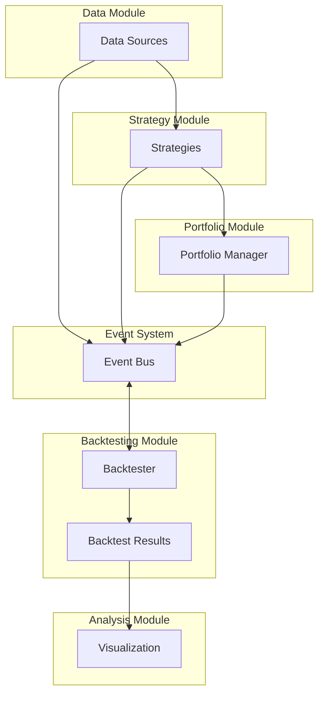

# Architecture Overview

## System Architecture

The Modular Backtesting System is designed with a focus on modularity, flexibility, and extensibility. The system is composed of several decoupled components that communicate through well-defined interfaces and an event-driven architecture.

## Core Components

### Data Module

The Data Module is responsible for loading and preprocessing market data from various sources. It provides a standardized interface for accessing market data, regardless of the source.

**Key Components:**
- `DataSource`: Base class for all data sources
- `CSVDataSource`: Implementation for loading data from CSV files
- `APIDataSource`: Implementation for fetching data from exchange APIs

### Strategy Module

The Strategy Module is responsible for generating buy/sell signals based on market data. It is completely decoupled from the backtesting logic, allowing for easy swapping of strategies.

**Key Components:**
- `Strategy`: Base class for all strategies
- `MovingAverageCrossover`: Implementation of a moving average crossover strategy
- `StrategyEnsemble`: Implementation for combining multiple strategies

### Portfolio Module

The Portfolio Module is responsible for managing positions and applying trading rules. It handles position sizing, risk management, and trade execution simulation.

**Key Components:**
- `PortfolioManager`: Base class for all portfolio managers
- `SimplePortfolioManager`: Implementation with fixed position sizing

### Event System

The Event System facilitates communication between components using an event-driven architecture. It allows for loose coupling between components and enables extensibility.

**Key Components:**
- `EventBus`: Central event dispatcher
- `EventType`: Enum of event types
- `Event`: Base class for all events

### Backtesting Module

The Backtesting Module is responsible for simulating trading based on signals from the strategy module and portfolio updates from the portfolio manager. It coordinates the interaction between all components.

**Key Components:**
- `Backtester`: Main backtesting engine
- `BacktestResults`: Container for backtest results

### Analysis Module

The Analysis Module is responsible for analyzing backtest results and generating performance metrics and visualizations.

**Key Components:**
- `metrics`: Functions for calculating performance metrics
- `visualization`: Functions for generating visualizations

## Data Flow

1. The `DataSource` loads market data and provides it to the `Strategy` and `Backtester`.
2. The `Strategy` analyzes the market data and generates buy/sell signals.
3. The `Backtester` receives the signals and simulates trade execution.
4. The `PortfolioManager` updates positions based on the simulated trades.
5. The `Backtester` generates `BacktestResults` containing the trade history and portfolio performance.
6. The `Analysis` module calculates performance metrics and generates visualizations based on the `BacktestResults`.

## Event-Driven Architecture

The system uses an event-driven architecture to facilitate communication between components. Events are dispatched through the `EventBus` and can be subscribed to by any component.

**Event Types:**
- `DATA_LOADED`: Triggered when new data is loaded
- `SIGNAL_GENERATED`: Triggered when a strategy generates a signal
- `TRADE_EXECUTED`: Triggered when a trade is executed
- `PORTFOLIO_UPDATED`: Triggered when the portfolio is updated
- `BACKTEST_COMPLETED`: Triggered when a backtest is completed

## Extensibility

The system is designed to be easily extensible:

1. **Custom Data Sources**: Create a new class that inherits from `DataSource` and implements the required methods.
2. **Custom Strategies**: Create a new class that inherits from `Strategy` and implements the required methods.
3. **Custom Portfolio Managers**: Create a new class that inherits from `PortfolioManager` and implements the required methods.
4. **Custom Events**: Create a new event type and add it to the `EventType` enum.

## Configuration

The system can be configured using YAML or JSON configuration files, allowing for easy setup and parameter tuning without modifying code.

See the [Configuration Guide](configuration.md) for more details. 