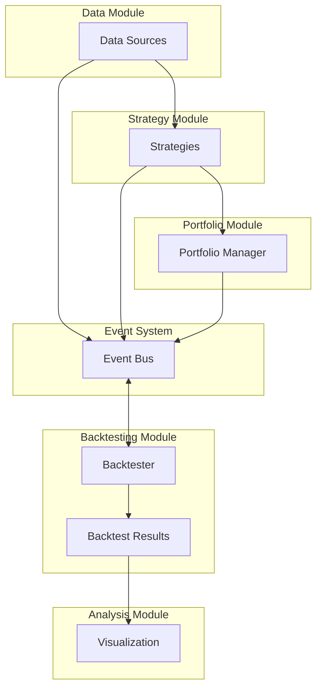

```mermaid
graph TD
    A[Data Sources] --> B[Strategies]
    B --> C[Portfolio Manager]
    A --> D[Event Bus]
    B --> D
    C --> D
    D <--> E[Backtester]
    E --> F[Backtest Results]
    F --> G[Visualization]
    
    subgraph Data Module
    A
    end
    
    subgraph Strategy Module
    B
    end
    
    subgraph Portfolio Module
    C
    end
    
    subgraph Event System
    D
    end
    
    subgraph Backtesting Module
    E
    F
    end
    
    subgraph Analysis Module
    G
    end
``` 